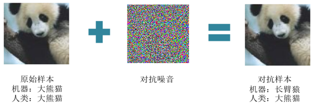

# Cifar10-Adversarial-Competition
BUAA 人工智能安全导论：Cifar-10 数字世界 无限制对抗攻击竞赛

## 1 背景介绍
近年来，人工智能技术在视觉识别领域有飞速的发展，但与此同时，人工智能模型的安全问题却不容乐观。通过引入对抗样本，攻击者很容易就可以通过肉眼几乎观察不到的微小扰动，使模型分类失误。



本次比赛希望可以让参赛选手**了解和探索 Cifar10 上的对抗攻击场景**，通过组合对抗攻击方案，实地**体验不同对抗攻击算法**特点。


## 2 题目要求
### 2.1 数据集
* 本赛事从 Cifar-10 数据集中筛选了 500 张 32 * 32 尺寸的图像
* 图像命名方式为 X.png ，其中 X 为 [0, 500) 范围内的整型数字
* 标签文件 label.txt，其中每一行代表：<图像名称> <图像类别>
```
|-- images
	|-- 0.png
	|-- 1.png
	|-- …
	|-- 499.png
|-- label.txt
```
### 2.2 模型说明
平台不公开的实现有若干判别模型，且针对初始的500张样本，判别模型预测成功率均为100%。

### 2.3 提交内容
* 提交一个攻击后数据集的zip压缩包，目录树应与上方相同
* 参赛者可以无需提交label.txt文件，即使提交也不会影响结果


## 3 评分规则
本次竞赛共分为客观分和主观分两部分。其中总体成绩中，主观分占比50%， 客观分占比50%。

客观得分为攻击效果得分和图像质量得分之**积**：
$$
Score_M = 100 \times Score_{ASR} \times Score_{SSIM}
$$

* 攻击效果得分为对抗样本误判比例：
$$
Score_{ASR}=\frac{||\{x'|F(x')\neq y\}||}{n}
$$
* 图像质量得分采用图像结构相似度SSIM:
$$
Score_{SSIM(x',x)}=\frac{(2\mu_{x}\mu_{x'}+C_1)(2\sigma_{xx'}+C_2)}{(\mu_{x}^2+\mu_{x'}^2+C_1)(\sigma_{x}^2+\sigma_{x'}^2+C_2)}
$$

主观分通过人工筛查，检查违规操作。主要测试以下几方面：
* 图像是否合乎规范
* 所提交图像的质量


## 附录
**1 Git规范**
```
# 拉取最新dev分支
git checkout dev
git pull origin

# 签出开发(或修复)分支
git checkout -b feature/xxx (or fix/xxx)

# 提交修改
git add .
git commit -m "[feat](xxx): message" (or "[fix](xxx): message")

# 解决与dev分支的冲突
git checkout dev
git pull origin
git checkout feature/xxx (or fix/xxx)
git rebase dev
git add .
git rebase --continue

# 提交开发/修复分支
git push origin
(pull request on github.com)

# 删除开发/修复分支
git checkout dev
git pull origin
git branch -d feature/xxx (or fix/xxx)
```